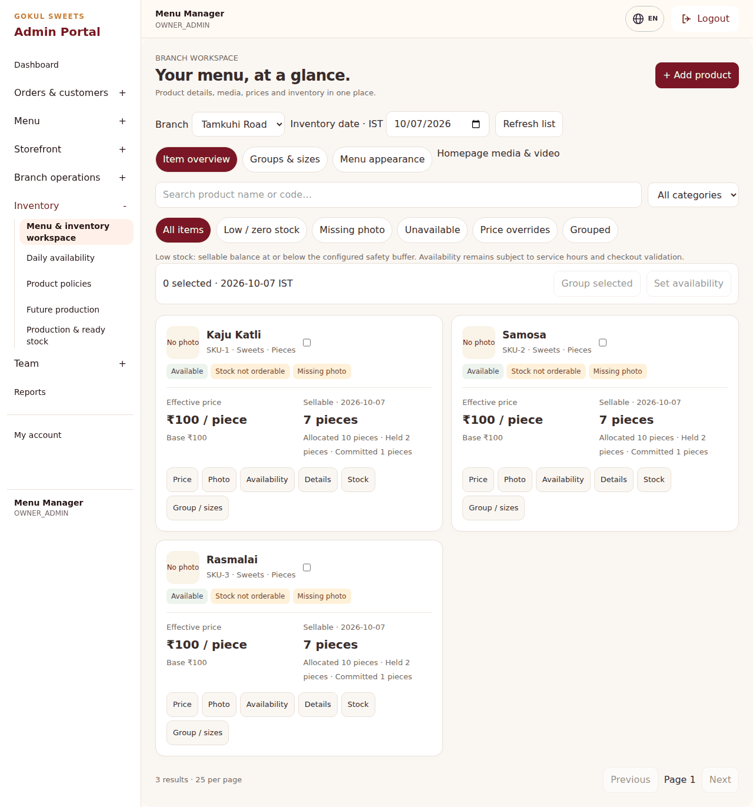
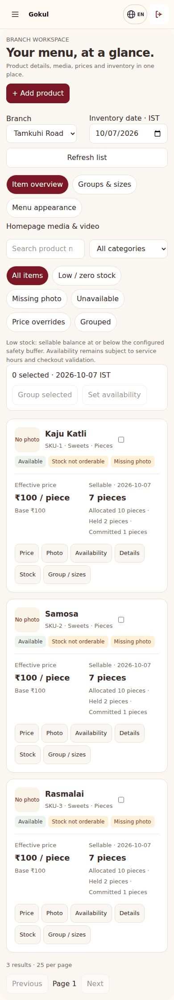
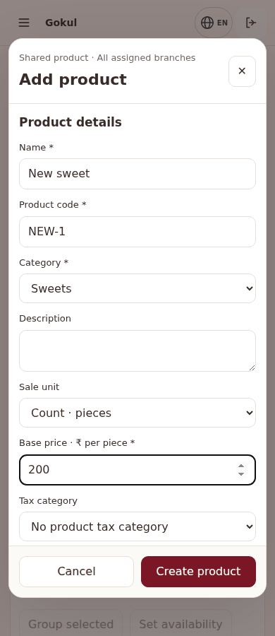
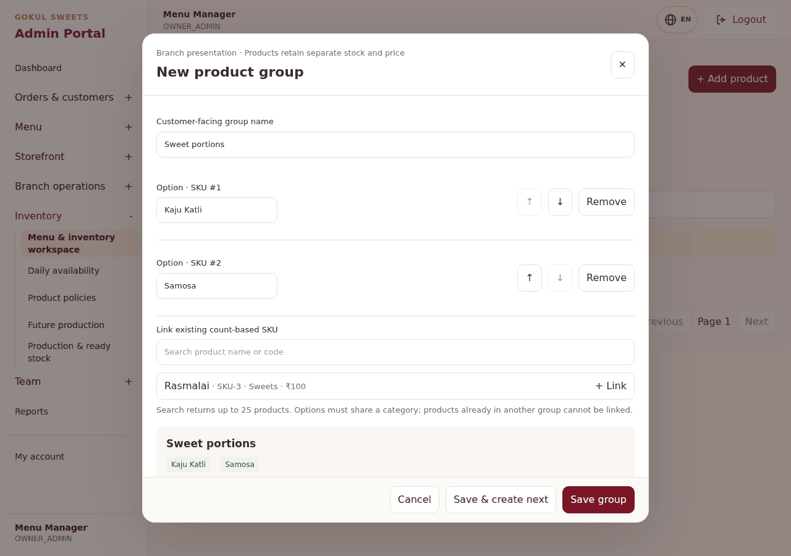
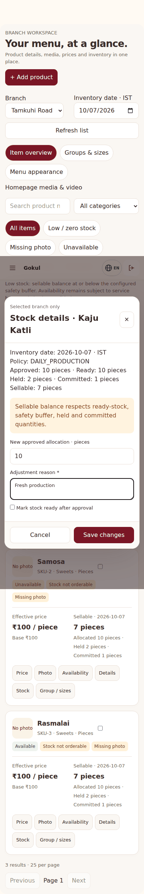
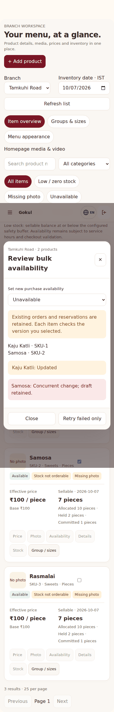
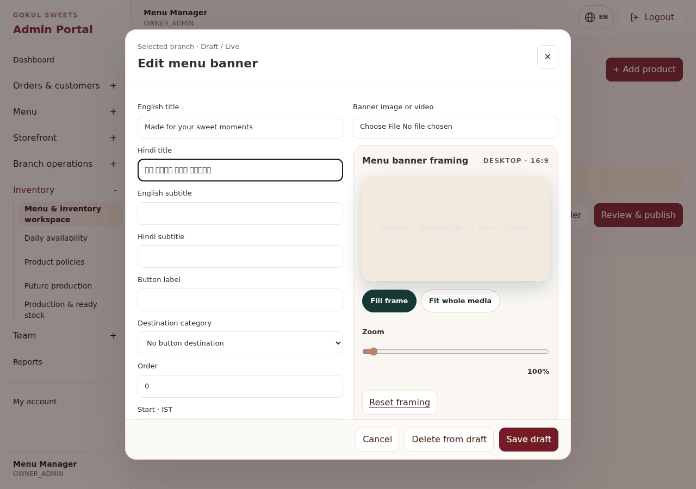

# Unified Menu & Inventory workspace

Open Admin → Menu & inventory workspace (`/admin/menu/workspace`). Uses the existing admin shell and palette. Legacy menu, inventory and campaign pages remain available.

## Behavior

- Product filtering and pagination run on the server, with 25 products per page and a hard maximum of 50. Photos use small lazy optimized thumbnails.
- Shared product details and images require access to every assigned branch. Branch overrides, availability, inventory and appearance apply to the selected branch. MENU_MANAGE and INVENTORY_VIEW are required; stock saves also require INVENTORY_MANAGE.
- Refresh restores the selected branch, tab, inventory date, search/filter/page, scroll position and open product/group/appearance text drafts within the same browser tab. Drafts retain their original conflict versions; Cancel discards them and successful saves clear them. Unsaved image/video files must be reselected after refresh.
- Branch switches clear stale results immediately; item, group and bulk actions wait for data matching the selected context. Group SKU search filters count products on the server before pagination. Appearance uses branch-assigned active categories; product creation retains the global category list.
- Add and edit actions use a native modal with its own scroll area and a visible footer. Search, filters and list position remain mounted. Entered data survives failed saves. Sale mode cannot change on existing SKUs because orders and stock units retain their original identity.
- New products start unavailable. Stock policies, date allocations and ready quantities can be configured in the stock popup. Service hours remain managed by the existing service-hours tool and enforced at checkout.
- Quantity-only stock adjustments preserve READY, DELAYED, UNAVAILABLE and CLOSED statuses and existing ready quantities. Changing readiness remains an explicit action. Appearance category editing waits for catalogue loading; cancelling a restored/conflicted draft reloads the current version, with a retry gate on reload failure.
- Weight stock displays grams/kilograms; count stock displays pieces. Held, committed and sellable quantities come from the existing inventory calculator. Low stock means sellable quantity is at or below its safety buffer.
- A branch or product update checks versions advanced by DB triggers, including writes from older tools/imports. Stock edits check allocation versions. Availability changes never cancel orders or release reservations.
- Bulk availability previews the branch and products, reports per-item results, and retries only failures. A genuine conflict needs the item to be reloaded and reviewed rather than forcefully overwritten.
- Groups have server pagination/search, one-group popup saves, SKU search, editable labels/order, a customer preview, and Save & create next. 2–6 same-category count SKUs per group, up to 500 groups per branch. Each retains its original price/tax/stock/service policy. Ungrouping never deletes products.
- Product photos have drag/zoom, rotation, fit/fill and an applied crop preview. Fit retains the full rotated image with white padding; Fill exports a crop. Editing is locked during processing, and pending exports are discarded if the editor closes. Partial product creation locks saved details/assignments while photo controls stay enabled; Retry Photo requires a newly applied file after refresh and never creates a second product. Replacements have unique R2 URLs; old files are cleaned only after DB commit. The legacy uploader now uses staff-session/CSRF-protected admin routes. Public write routes are disabled.
- Branch appearance has English/Hindi copy, category destination, image/video framing, static video poster, IST dates, order, visibility, category images/order, explicit draft save and publish. Public menu reads only published content. Existing layout/content remain fallback when configuration is absent or unavailable.

## Image configuration

An upload response confirms object storage and DB save; the public media URL also needs to be readable. If an image fails to load, check `cloudflare.r2.public-url`, bucket public access and the returned URL. R2 development public hosts are supported by Next image optimization. For a custom HTTPS media domain, set `NEXT_PUBLIC_MEDIA_BASE_URL` before building the frontend. This is a public URL, not a storage credential. No live R2 configuration was changed by this PR.

## Validation

Production frontend build, TypeScript, lint, 147 Node tests and the customer theme contract passed locally. Browser regression exercises the actual built frontend with intercepted API fixtures at 320, 390 and 1280px: failed-save recovery, add product, stock request, partial bulk results/retry, group editing, draft/publish isolation, delayed category loading, discard/reload after appearance conflicts, partial photo recovery, and exported pixels for Fit, rotated Fit and Fill, and delayed-processing locks that prevent obsolete rotation results. Screenshots below are real browser captures with sample fixtures, not production data.

Backend CI for the initial implementation passed. Follow-up tests also cover count-SKU filtering before pagination, branch-specific appearance categories and preservation of ready/paused stock statuses. Backend integration tests cover bounded queries, stale writes, cross-branch shared edits, preservation of other groups, retained stock commitments and draft/live isolation. Local backend execution remains blocked by Java/Gradle availability; GitHub CI must validate follow-up changes before merge.

## QA on dev after manual deployment

1. Sign in as owner and branch manager. Verify only allowed branches appear and the branch survives refresh.
2. Search/filter/page a catalogue of several hundred products. Edit a price or photo and verify the same list context remains; test 320/390px Android and desktop.
3. Add a product with a unique code; verify unavailable status, branch assignment, correct tax/unit settings and no automatic inventory. Simulate a failed photo upload after creation and retry without duplicating the product.
4. Open the same item in two sessions. Save one and verify the second receives a conflict with its draft retained. Test a legacy price update/import too.
5. Replace a real photo and verify the returned new public URL, admin thumbnail and customer menu. Check failure handling with an inaccessible R2 URL. Rotate/crop/fit/fill photos; frame banner videos and supply a static poster.
6. Adjust dated stock with a reason. Verify audit history, existing holds/commitments, inventory unit formatting and backend rejection below reservations. Check ready-stock and non-simple policy explanations.
7. Bulk-toggle selected items, including one stale item. Confirm successes are not retried; reload/review the conflicted item before a new operation.
8. Create and edit groups from selected items and from group search. Reorder/link/unlink options, save/create next, ungroup, and verify each SKU remains intact. Confirm a group beyond page one opens from its product card.
9. Save an appearance draft: the customer menu must not change. Publish and verify copy, category images/order and button navigation. Check Hindi, reduced-motion video fallback and IST start/end boundaries.
10. Verify prices/stock/service hours are revalidated at checkout; no marketing change implies a stock promise or discount.

## Screenshots

